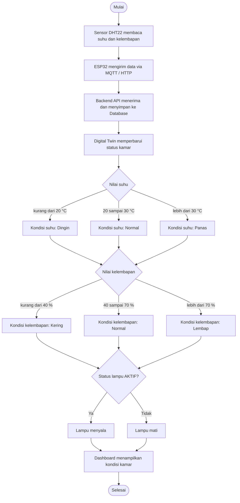

```mermaid
flowchart TD
    Start(["Mulai"]) --> A["Sensor DHT22 membaca suhu dan kelembapan"]
    A --> B["ESP32 mengirim data via MQTT / HTTP"]
    B --> C["Backend API menerima dan menyimpan ke Database"]
    C --> D["Digital Twin memperbarui status kamar"]
    D --> E{"Nilai suhu"}
    E -- "kurang dari 20 °C" --> E1["Kondisi suhu: Dingin"]
    E -- "20 sampai 30 °C" --> E2["Kondisi suhu: Normal"]
    E -- "lebih dari 30 °C" --> E3["Kondisi suhu: Panas"]
    E1 --> F{"Nilai kelembapan"}
    E2 --> F
    E3 --> F
    F -- "kurang dari 40 %" --> F1["Kondisi kelembapan: Kering"]
    F -- "40 sampai 70 %" --> F2["Kondisi kelembapan: Normal"]
    F -- "lebih dari 70 %" --> F3["Kondisi kelembapan: Lembap"]
    F1 --> G{"Status lampu AKTIF?"}
    F2 --> G
    F3 --> G
    G -- "Ya" --> G1["Lampu menyala"]
    G -- "Tidak" --> G2["Lampu mati"]
    G1 --> H["Dashboard menampilkan kondisi kamar"]
    G2 --> H
    H --> End(["Selesai"])
```
