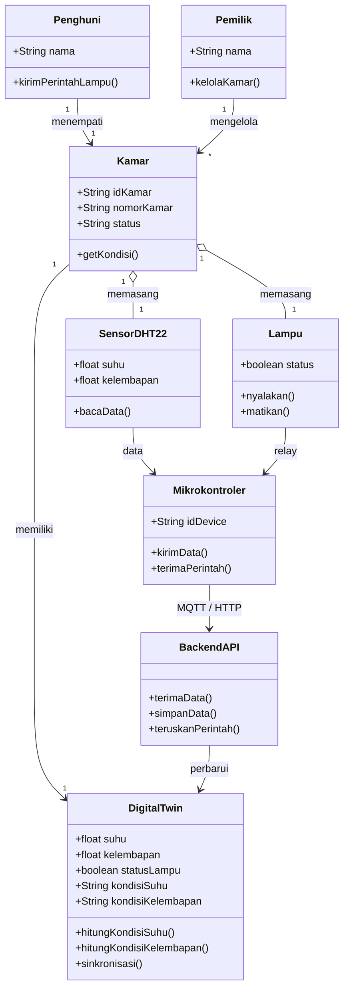

```mermaid
classDiagram
    class Kamar {
        +String idKamar
        +String nomorKamar
        +String status
        +getKondisi()
    }
    class DigitalTwin {
        +float suhu
        +float kelembapan
        +boolean statusLampu
        +String kondisiSuhu
        +String kondisiKelembapan
        +hitungKondisiSuhu()
        +hitungKondisiKelembapan()
        +sinkronisasi()
    }
    class SensorDHT22 {
        +float suhu
        +float kelembapan
        +bacaData()
    }
    class Lampu {
        +boolean status
        +nyalakan()
        +matikan()
    }
    class Mikrokontroler {
        +String idDevice
        +kirimData()
        +terimaPerintah()
    }
    class BackendAPI {
        +terimaData()
        +simpanData()
        +teruskanPerintah()
    }
    class Penghuni {
        +String nama
        +kirimPerintahLampu()
    }
    class Pemilik {
        +String nama
        +kelolaKamar()
    }

    Kamar "1" --> "1" DigitalTwin : memiliki
    Kamar "1" o-- "1" SensorDHT22 : memasang
    Kamar "1" o-- "1" Lampu : memasang
    Penghuni "1" --> "1" Kamar : menempati
    Pemilik "1" --> "*" Kamar : mengelola
    SensorDHT22 --> Mikrokontroler : data
    Lampu --> Mikrokontroler : relay
    Mikrokontroler --> BackendAPI : MQTT / HTTP
    BackendAPI --> DigitalTwin : perbarui
```
