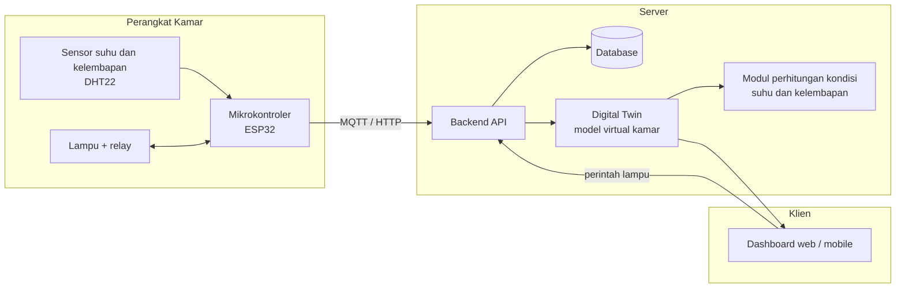

```mermaid
flowchart LR
    subgraph PK["Perangkat Kamar"]
        S1["Sensor suhu dan kelembapan<br/>DHT22"]
        M["Mikrokontroler<br/>ESP32"]
        L["Lampu + relay"]
    end

    subgraph SV["Server"]
        B["Backend API"]
        D[("Database")]
        T["Digital Twin<br/>model virtual kamar"]
        K["Modul perhitungan kondisi<br/>suhu dan kelembapan"]
    end

    subgraph KL["Klien"]
        U["Dashboard web / mobile"]
    end

    S1 --> M
    L <--> M
    M -- "MQTT / HTTP" --> B
    B --> D
    B --> T
    T --> K
    T --> U
    U -- "perintah lampu" --> B
```
