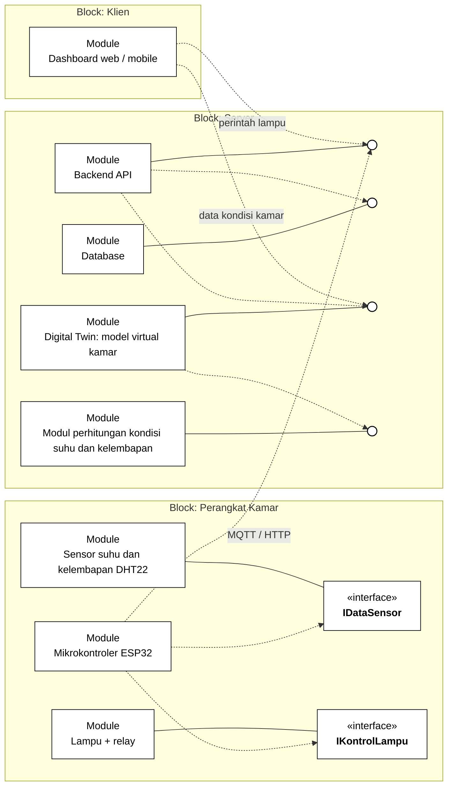

```mermaid
flowchart LR
    subgraph PK["Block: Perangkat Kamar"]
        direction TB
        IFS["«interface»<br/><b>IDataSensor</b>"]
        IFL["«interface»<br/><b>IKontrolLampu</b>"]
        S1["Module<br/>Sensor suhu dan kelembapan DHT22"]
        M["Module<br/>Mikrokontroler ESP32"]
        L["Module<br/>Lampu + relay"]
        M -.-> IFS
        M -.-> IFL
        S1 --- IFS
        L --- IFL
    end

    subgraph SV["Block: Server"]
        direction TB
        B["Module<br/>Backend API"]
        D["Module<br/>Database"]
        T["Module<br/>Digital Twin: model virtual kamar"]
        K["Module<br/>Modul perhitungan kondisi suhu dan kelembapan"]
        PB(( ))
        PD(( ))
        PT(( ))
        PK2(( ))
        B --- PB
        D --- PD
        T --- PT
        K --- PK2
        B -.-> PD
        B -.-> PT
        T -.-> PK2
    end

    subgraph KL["Block: Klien"]
        U["Module<br/>Dashboard web / mobile"]
    end

    M -. "MQTT / HTTP" .-> PB
    U -. "perintah lampu" .-> PB
    U -. "data kondisi kamar" .-> PT

    classDef comp fill:#fff,stroke:#000,color:#000
    classDef iface fill:#fff,stroke:#000,color:#000
    classDef lolli fill:#fff,stroke:#000,stroke-width:1.5px
    class S1,M,L,B,D,T,K,U comp
    class IFS,IFL iface
    class PB,PD,PT,PK2 lolli
```
