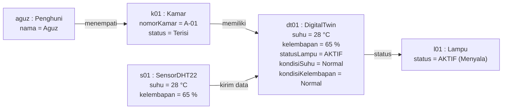

```mermaid
flowchart LR
    budi["aguz : Penghuni<br/>nama = Aguz"]
    k01["k01 : Kamar<br/>nomorKamar = A-01<br/>status = Terisi"]
    dt01["dt01 : DigitalTwin<br/>suhu = 28 °C<br/>kelembapan = 65 %<br/>statusLampu = AKTIF<br/>kondisiSuhu = Normal<br/>kondisiKelembapan = Normal"]
    s01["s01 : SensorDHT22<br/>suhu = 28 °C<br/>kelembapan = 65 %"]
    l01["l01 : Lampu<br/>status = AKTIF (Menyala)"]

    budi -- "menempati" --> k01
    k01 -- "memiliki" --> dt01
    s01 -- "kirim data" --> dt01
    dt01 -- "status" --> l01
```
