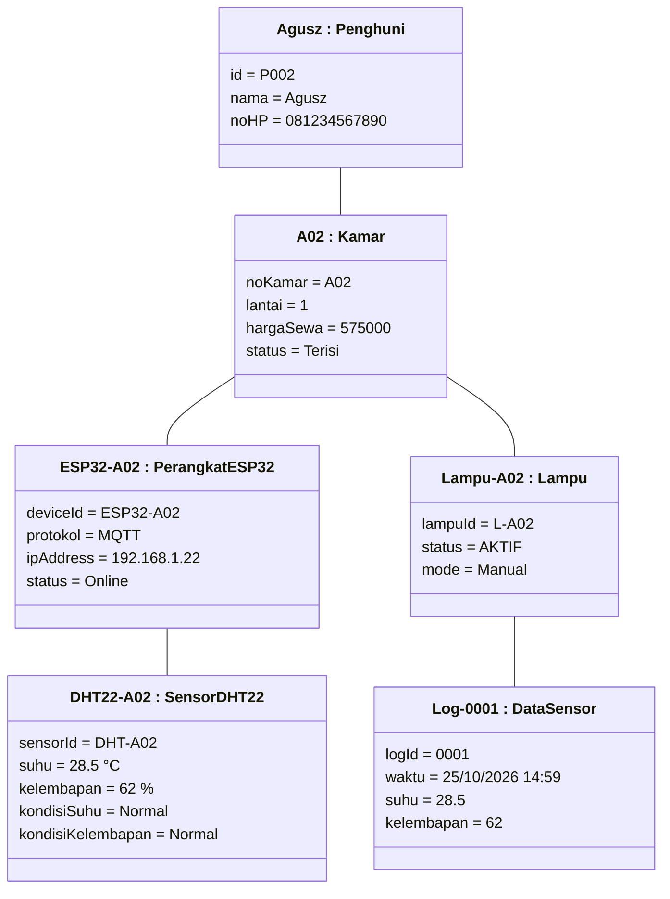

# Object Diagram - Digital Twin Kamar Kos

```mermaid
classDiagram
    direction TB

    class Agusz["Agusz : Penghuni"] {
        id = P002
        nama = Agusz
        noHP = 081234567890
    }

    class KamarA02["A02 : Kamar"] {
        noKamar = A02
        lantai = 1
        hargaSewa = 575000
        status = Terisi
    }

    class Esp32["ESP32-A02 : PerangkatESP32"] {
        deviceId = ESP32-A02
        protokol = MQTT
        ipAddress = 192.168.1.22
        status = Online
    }

    class Dht22["DHT22-A02 : SensorDHT22"] {
        sensorId = DHT-A02
        suhu = 28.5 °C
        kelembapan = 62 %
        kondisiSuhu = Normal
        kondisiKelembapan = Normal
    }

    class Lampu["Lampu-A02 : Lampu"] {
        lampuId = L-A02
        status = AKTIF
        mode = Manual
    }

    class Log["Log-0001 : DataSensor"] {
        logId = 0001
        waktu = 25/10/2026 14:59
        suhu = 28.5
        kelembapan = 62
    }

    Agusz -- KamarA02
    KamarA02 -- Esp32
    Esp32 -- Dht22
    KamarA02 -- Lampu
    Lampu -- Log
```
