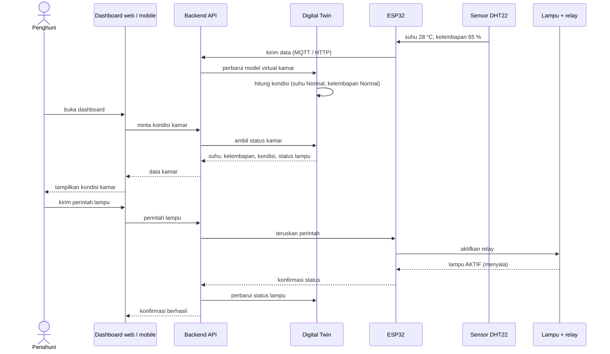

```mermaid
sequenceDiagram
    actor U as Penghuni
    participant W as Dashboard web / mobile
    participant B as Backend API
    participant T as Digital Twin
    participant M as ESP32
    participant S as Sensor DHT22
    participant L as Lampu + relay

    S->>M: suhu 28 °C, kelembapan 65 %
    M->>B: kirim data (MQTT / HTTP)
    B->>T: perbarui model virtual kamar
    T->>T: hitung kondisi (suhu Normal, kelembapan Normal)
    U->>W: buka dashboard
    W->>B: minta kondisi kamar
    B->>T: ambil status kamar
    T-->>B: suhu, kelembapan, kondisi, status lampu
    B-->>W: data kamar
    W-->>U: tampilkan kondisi kamar
    U->>W: kirim perintah lampu
    W->>B: perintah lampu
    B->>M: teruskan perintah
    M->>L: aktifkan relay
    L-->>M: lampu AKTIF (menyala)
    M-->>B: konfirmasi status
    B->>T: perbarui status lampu
    B-->>W: konfirmasi berhasil
```
