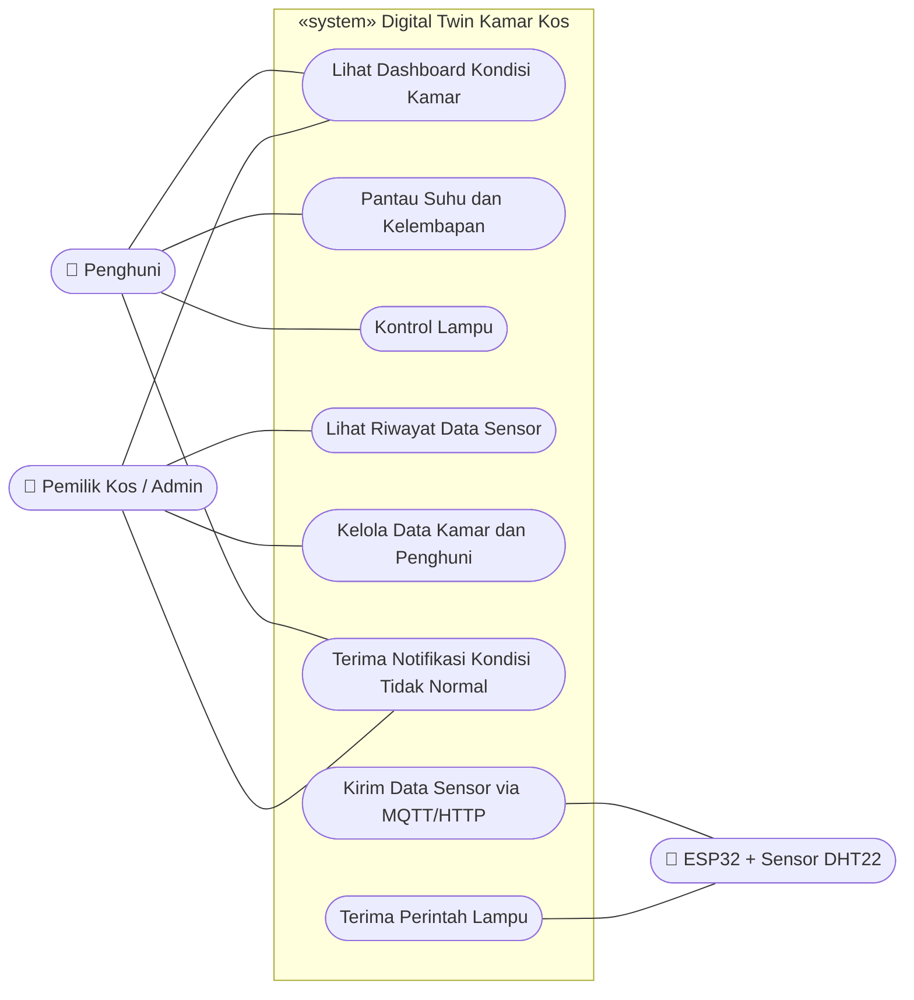

```mermaid
flowchart LR
    P["Penghuni"]
    T["Teknisi"]
    B["Backend API"]

    subgraph SYS["«subsystem»<br/>Digital Twin Kamar Kos"]
        UC1(["Lihat Suhu dan Kelembapan"])
        UC2(["Lihat Kondisi Kamar"])
        UC3(["Nyalakan Lampu"])
        UC4(["Matikan Lampu"])
        UC5(["Maintenance Sensor"])
        UC6(["Perbaikan Perangkat"])
    end

    P --- UC1
    P --- UC2
    P --- UC3
    P --- UC4

    T --- UC5
    T --- UC6

    UC1 --- B
    UC2 --- B
    UC3 --- B
    UC4 --- B
    UC5 --- B
    UC6 --- B
```

```mermaid
flowchart LR
    Penghuni(["👤 Penghuni"])
    Admin(["👤 Pemilik Kos / Admin"])
    ESP32(["👤 ESP32 + Sensor DHT22"])

    subgraph DT ["«system» Digital Twin Kamar Kos"]
        direction TB
        UC1(["Lihat Dashboard Kondisi Kamar"])
        UC2(["Pantau Suhu dan Kelembapan"])
        UC3(["Kontrol Lampu"])
        UC4(["Lihat Riwayat Data Sensor"])
        UC5(["Kelola Data Kamar dan Penghuni"])
        UC6(["Terima Notifikasi Kondisi Tidak Normal"])
        UC7(["Kirim Data Sensor via MQTT/HTTP"])
        UC8(["Terima Perintah Lampu"])
    end

    Penghuni --- UC1
    Penghuni --- UC2
    Penghuni --- UC3
    Penghuni --- UC6

    Admin --- UC1
    Admin --- UC4
    Admin --- UC5
    Admin --- UC6

    UC7 --- ESP32
    UC8 --- ESP32
```
