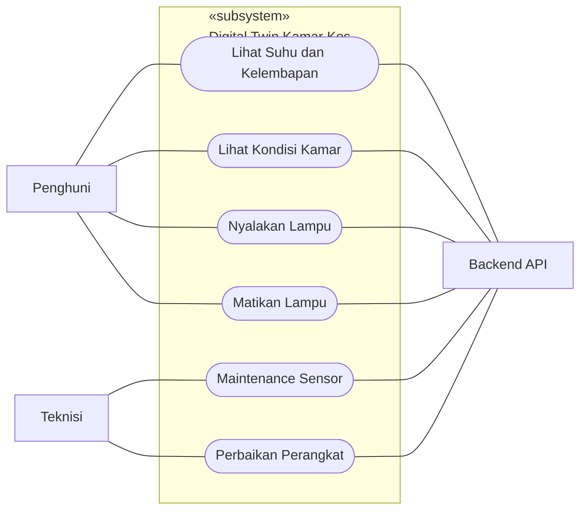

```mermaid
flowchart LR
    P["Penghuni"]
    T["Teknisi"]
    B["Backend API"]

    subgraph SYS["«subsystem»<br/>Digital Twin Kamar Kos"]
        UC1(["Lihat Suhu dan Kelembapan"])
        UC2(["Lihat Kondisi Kamar"])
        UC3(["Nyalakan Lampu"])
        UC4(["Matikan Lampu"])
        UC5(["Maintenance Sensor"])
        UC6(["Perbaikan Perangkat"])
    end

    P --- UC1
    P --- UC2
    P --- UC3
    P --- UC4

    T --- UC5
    T --- UC6

    UC1 --- B
    UC2 --- B
    UC3 --- B
    UC4 --- B
    UC5 --- B
    UC6 --- B
```
