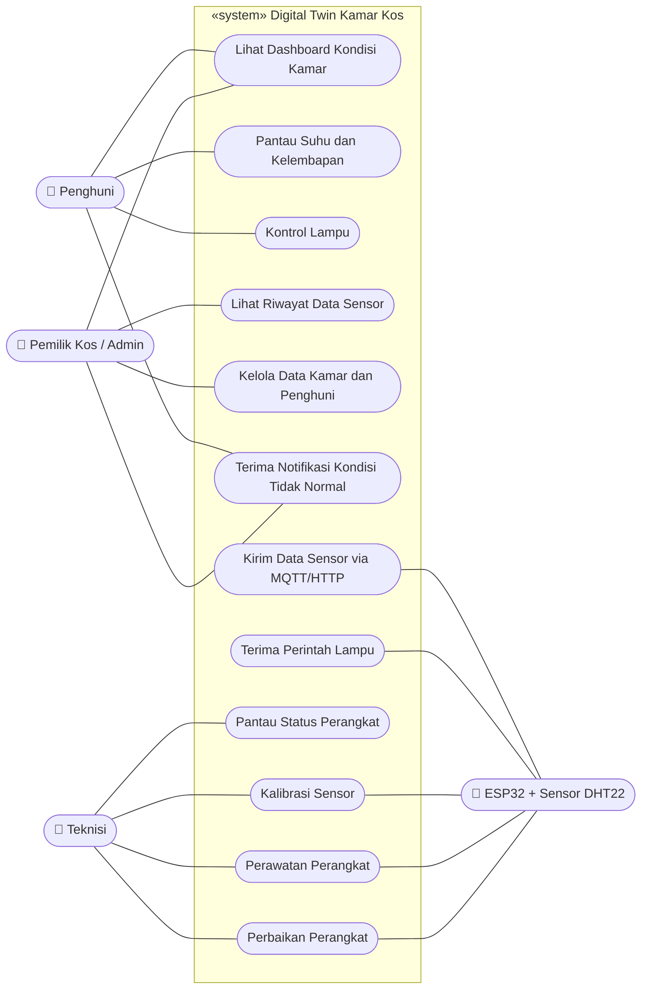

```mermaid
flowchart LR
    Penghuni(["👤 Penghuni"])
    Admin(["👤 Pemilik Kos / Admin"])
    Teknisi(["👤 Teknisi"])
    ESP32(["👤 ESP32 + Sensor DHT22"])

    subgraph DT ["«system» Digital Twin Kamar Kos"]
        direction TB
        UC1(["Lihat Dashboard Kondisi Kamar"])
        UC2(["Pantau Suhu dan Kelembapan"])
        UC3(["Kontrol Lampu"])
        UC4(["Lihat Riwayat Data Sensor"])
        UC5(["Kelola Data Kamar dan Penghuni"])
        UC6(["Terima Notifikasi Kondisi Tidak Normal"])
        UC7(["Kirim Data Sensor via MQTT/HTTP"])
        UC8(["Terima Perintah Lampu"])
        UC9(["Pantau Status Perangkat"])
        UC10(["Kalibrasi Sensor"])
        UC11(["Perawatan Perangkat"])
        UC12(["Perbaikan Perangkat"])
    end

    Penghuni --- UC1
    Penghuni --- UC2
    Penghuni --- UC3
    Penghuni --- UC6

    Admin --- UC1
    Admin --- UC4
    Admin --- UC5
    Admin --- UC6

    Teknisi --- UC9
    Teknisi --- UC10
    Teknisi --- UC11
    Teknisi --- UC12

    UC7 --- ESP32
    UC8 --- ESP32
    UC10 --- ESP32
    UC11 --- ESP32
    UC12 --- ESP32
```
