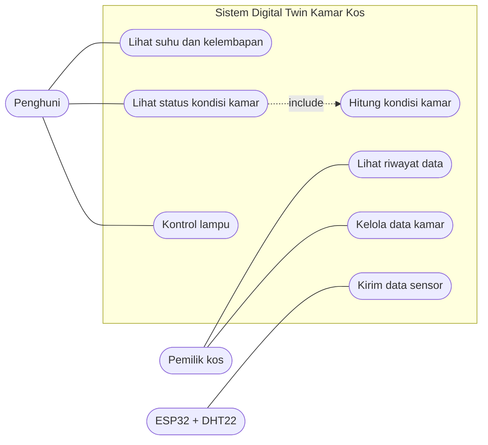

```mermaid
flowchart LR
    P(["Penghuni"])
    O(["Pemilik kos"])
    M(["ESP32 + DHT22"])

    subgraph SYS["Sistem Digital Twin Kamar Kos"]
        UC1(["Lihat suhu dan kelembapan"])
        UC2(["Lihat status kondisi kamar"])
        UC3(["Hitung kondisi kamar"])
        UC4(["Kontrol lampu"])
        UC5(["Lihat riwayat data"])
        UC6(["Kelola data kamar"])
        UC7(["Kirim data sensor"])
    end

    P --- UC1
    P --- UC2
    P --- UC4
    O --- UC5
    O --- UC6
    M --- UC7
    UC2 -. include .-> UC3
```
