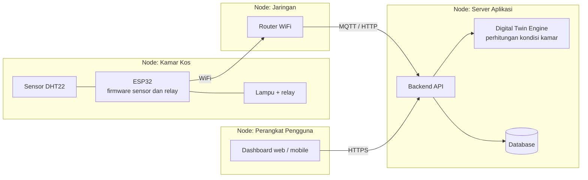

```mermaid
flowchart LR
    subgraph N1["Node: Kamar Kos"]
        DHT["Sensor DHT22"]
        ESP["ESP32<br/>firmware sensor dan relay"]
        LMP["Lampu + relay"]
    end

    subgraph N2["Node: Jaringan"]
        R["Router WiFi"]
    end

    subgraph N3["Node: Server Aplikasi"]
        API["Backend API"]
        DT["Digital Twin Engine<br/>perhitungan kondisi kamar"]
        DB[("Database")]
    end

    subgraph N4["Node: Perangkat Pengguna"]
        WEB["Dashboard web / mobile"]
    end

    DHT --- ESP
    ESP --- LMP
    ESP -- "WiFi" --> R
    R -- "MQTT / HTTP" --> API
    API --> DT
    API --> DB
    WEB -- "HTTPS" --> API
```
