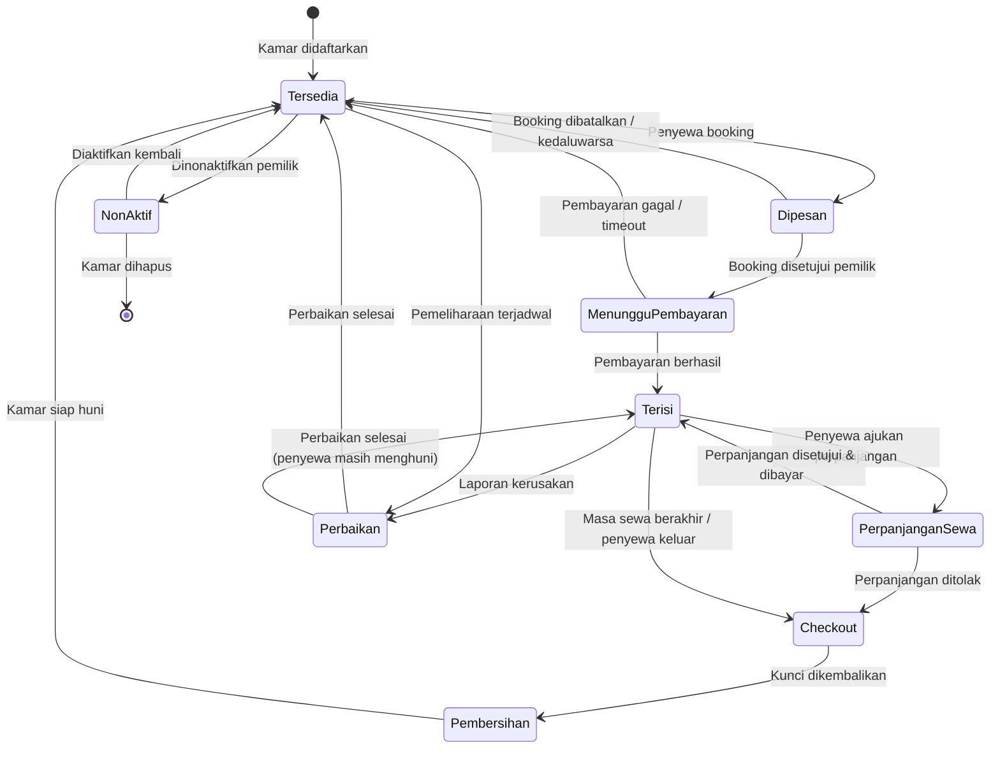
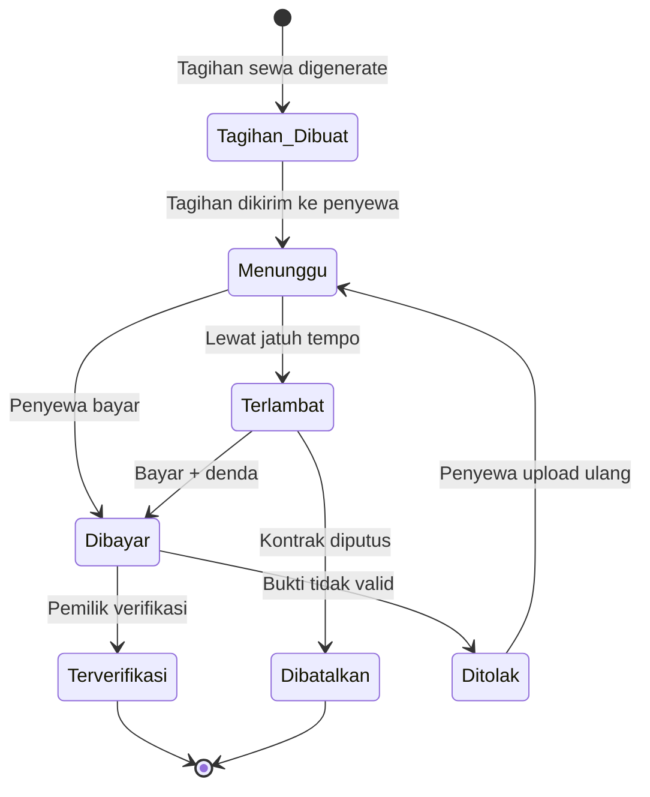
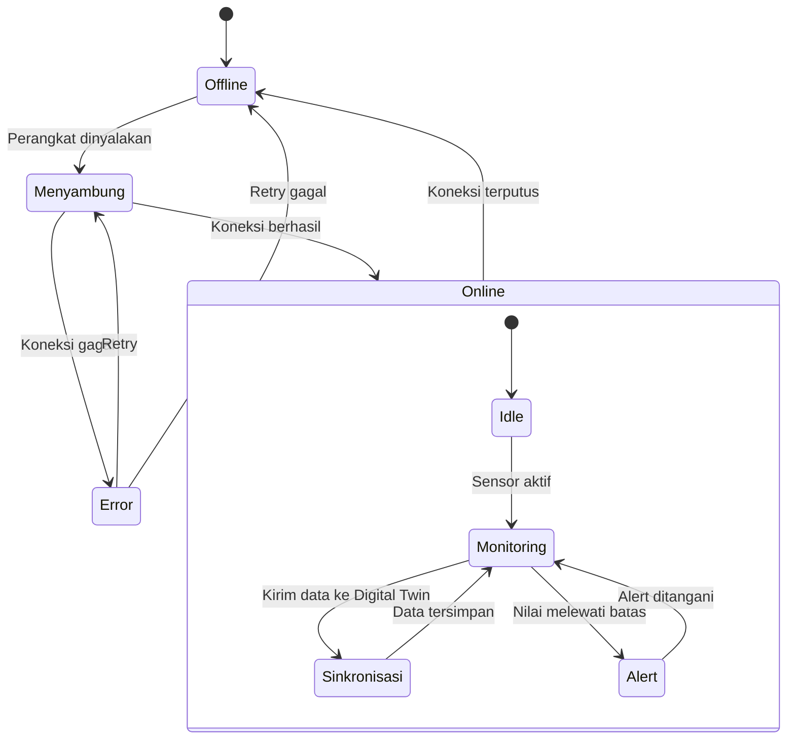

# State Diagram - Digital Twin Rental Room Kost

## 1. State Diagram Status Kamar

```mermaid
stateDiagram-v2
    [*] --> Tersedia : Kamar didaftarkan

    Tersedia --> Dipesan : Penyewa booking
    Dipesan --> Tersedia : Booking dibatalkan / kedaluwarsa
    Dipesan --> MenungguPembayaran : Booking disetujui pemilik
    MenungguPembayaran --> Tersedia : Pembayaran gagal / timeout
    MenungguPembayaran --> Terisi : Pembayaran berhasil

    Terisi --> PerpanjanganSewa : Penyewa ajukan perpanjangan
    PerpanjanganSewa --> Terisi : Perpanjangan disetujui & dibayar
    PerpanjanganSewa --> Checkout : Perpanjangan ditolak
    Terisi --> Checkout : Masa sewa berakhir / penyewa keluar

    Checkout --> Pembersihan : Kunci dikembalikan
    Pembersihan --> Tersedia : Kamar siap huni

    Terisi --> Perbaikan : Laporan kerusakan
    Tersedia --> Perbaikan : Pemeliharaan terjadwal
    Perbaikan --> Tersedia : Perbaikan selesai
    Perbaikan --> Terisi : Perbaikan selesai (penyewa masih menghuni)

    Tersedia --> NonAktif : Dinonaktifkan pemilik
    NonAktif --> Tersedia : Diaktifkan kembali
    NonAktif --> [*] : Kamar dihapus
```

## 2. State Diagram Pembayaran Sewa

```mermaid
stateDiagram-v2
    [*] --> Tagihan_Dibuat : Tagihan sewa digenerate

    Tagihan_Dibuat --> Menunggu : Tagihan dikirim ke penyewa
    Menunggu --> Dibayar : Penyewa bayar
    Menunggu --> Terlambat : Lewat jatuh tempo

    Terlambat --> Dibayar : Bayar + denda
    Terlambat --> Dibatalkan : Kontrak diputus

    Dibayar --> Terverifikasi : Pemilik verifikasi
    Dibayar --> Ditolak : Bukti tidak valid
    Ditolak --> Menunggu : Penyewa upload ulang

    Terverifikasi --> [*]
    Dibatalkan --> [*]
```

## 3. State Diagram Perangkat IoT (Digital Twin)

```mermaid
stateDiagram-v2
    [*] --> Offline

    Offline --> Menyambung : Perangkat dinyalakan
    Menyambung --> Online : Koneksi berhasil
    Menyambung --> Error : Koneksi gagal

    state Online {
        [*] --> Idle
        Idle --> Monitoring : Sensor aktif
        Monitoring --> Sinkronisasi : Kirim data ke Digital Twin
        Sinkronisasi --> Monitoring : Data tersimpan
        Monitoring --> Alert : Nilai melewati batas
        Alert --> Monitoring : Alert ditangani
    }

    Online --> Offline : Koneksi terputus
    Error --> Menyambung : Retry
    Error --> Offline : Retry gagal
```
